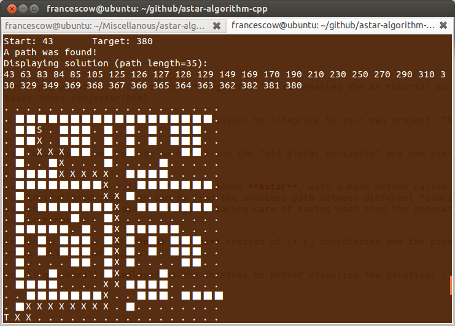

astar-algorithm-cpp
===================

Summary
-------

This code is an efficient implementation in C++ of the A* algorithm. It accompanies the A* tutorial on this site: http://www.heyes-jones.com/astar.html

The following repo is a fork adapted to be more modular and easier to integrate in your own project.

Code Details
------------

The major differences from the original version are:

1. **MapSearchNode** class was separated from the main file and the "old global variables" are now static members, also GetMap is now using a *row-major order* logic for the matrix.

2. An interface class was defined for the *stlastar* class, named **Astar**, with a main method called **run**. The class can be instantiated just once and to find the shortest path between different *start*-*target* couples just use the *run* method again and again, taking care of saving each time the generated path (the *astarPath* public member).

3. The interface is intended to be used with **node indexes** instead of (x,y) coordinates and the path generated by *Astar.run* is filled accordingly.

4. Now the solution found is graphically displayed on the terminal to better visualize the solution! :)

Structure and usage
-------------------

This implementation is intended to be simple to read yet fairly
efficient. To build it you can compile, with any recent C++ compiler,
the following files :

1. **For path finder**

* astar_demo.cpp
* Astar.h
* MapSearchNode.h
* stlastar.h
* optionally fsa.h

To compile using g++:

    g++ astar_demo.cpp -o astar_demo -I ./

You can edit the simple map and the start and goal coordinates in astar_demo to experiement with the A* pathfinder algorithm.

Fixed size allocator notes: As mentioned briefly in the tutorial you can enable and disable the
faster memory allocation. This allocates a fixed size block of memory, so you have to specify this size
with the astar constructor. You need to enlarge it if you hit an out of memory assert during the
search.

2. **For 8-puzzle solver**

* 8puzzle.cpp
* stlastar.h
* optionally fsa.h

8puzzle with no arguments runs with one of the boards in the cpp file, you can
select the one you want changing the conditional compiliation instructions. Or if you
prefer pass in a board on the command line using digits for the tile positions, where
zero is the space. The board runs from left to right, each row at a time:
	
    8puzzle 013824765

License
=======

This software is released under the MIT License, see license.txt
